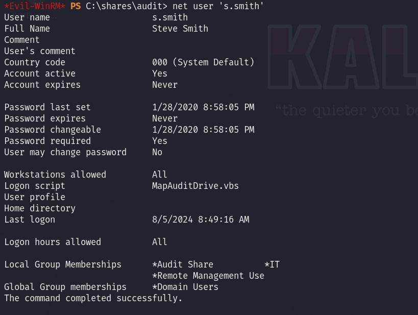
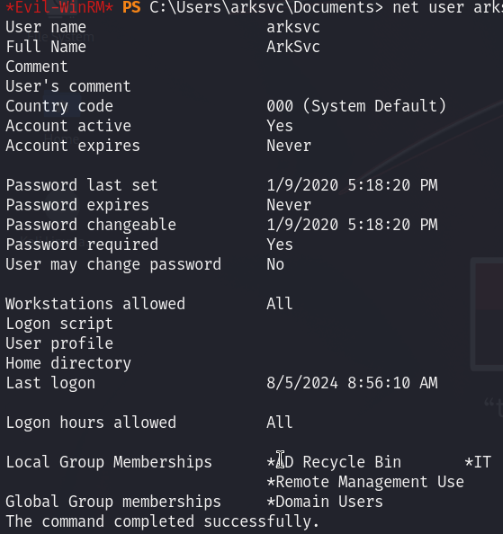

# Cascade — HackTheBox Walkthrough

**Platform:** HackTheBox
**Difficulty:** Medium
**OS:** Windows

---

## TL;DR

Anonymous SMB enumeration and LDAP querying reveals a base64 encoded legacy password for `r.thompson` → Accessing the `Data` share exposes a VNC password hash that we decrypt to get `s.smith` credentials → Enumerating the `Audit$` share unveils an encrypted SQLite database and a compiled executable → Reverse-engineering `Cascaudit.exe` recovers the `arksvc` password → `arksvc` is part of the `AD Recycle Bin` group, allowing us to query deleted AD objects to recover the Administrator password.

---

## Enumeration

Full nmap scan:

```bash
nmap -sC -sV -p- -n -Pn 10.10.10.182
```

**Open Ports:**
| Port | Service | Version |
|------|---------|---------|
| 53 | DNS | Microsoft DNS 6.1.7601 (Windows Server 2008 R2 SP1) |
| 88 | Kerberos | Microsoft Windows Kerberos |
| 135 | RPC | Microsoft Windows RPC |
| 139 | NetBIOS | Microsoft Windows netbios-ssn |
| 389 | LDAP | Microsoft Windows AD LDAP (Domain: cascade.local) |
| 445 | SMB | microsoft-ds |
| 636 | LDAP (SSL) | tcpwrapped |
| 3268 | Global Catalog | Microsoft Windows AD LDAP |
| 5985 | WinRM | Microsoft HTTPAPI httpd 2.0 |

The box is a Windows Server 2008 Domain Controller for `cascade.local`.

---

## Exploitation — LDAP Enumeration & VNC Password

We begin by checking for anonymous SMB access. While we can connect to the IPC$ share anonymously, we cannot list or access any concrete file shares.

We can enumerate a list of valid Domain Users by probing via `crackmapexec` (RPC/SAMR):

```bash
crackmapexec smb 10.10.10.182 -u '' -p '' --users
```

This successfully dumps several users, including `r.thompson`, `s.smith`, `arksvc`, and `CascGuest`. Trying to use the usernames as passwords (password spraying) yields no results.

Since anonymous SMB didn't give us files, we turn to **LDAP**. We can anonymously query the LDAP directory to dump all Active Directory information:

```bash
ldapsearch -H ldap://10.10.10.182/ -x -b "DC=cascade,DC=local" > ldap_dump.txt
```

Searching through the raw `ldap_dump.txt` output for anything interesting or non-standard, we look for custom attributes. 

```bash
cat ldap_dump.txt | awk '{print$1}' | sort | uniq -c | sort -n
```

We notice a highly unusual custom attribute named `cascadeLegacyPwd:`. Looking closely at the entry for user `r.thompson`, we find:
`cascadeLegacyPwd: clk0bjVldmE=`

This is a Base64 encoded string. We decode it:

```bash
echo -n 'clk0bjVldmE=' | base64 -d
```

The decoded password is `rY4n5eva`. We now have our first set of valid credentials: `r.thompson:rY4n5eva`.

Using these credentials, we enumerate the SMB shares again and discover we can now read the `Data` share. Inside the `Data` share, we find a registry file named `VNC Install.reg`.

Within `VNC Install.reg`, there is an encrypted VNC password stored in hex format (`6bcf2a4b6e5aca0f`). VNC uses a known, hardcoded DES key to encrypt passwords, meaning we can instantly decrypt it using `openssl`:

```bash
echo -n 6bcf2a4b6e5aca0f | xxd -r -p | openssl enc -des-cbc --nopad --nosalt -K e84ad660c4721ae0 -iv 0000000000000000 -d | hexdump -Cv
```

The decrypted VNC password is `sT333ve2`. We spray this password across our known user list and find that it belongs to `s.smith`. 

Credentials obtained: `s.smith:sT333ve2`.
We now have user access.

---

## Privilege Escalation — Reverse Engineering & AD Recycle Bin

Logging into SMB with `s.smith` grants us access to the `Audit$` share.



Inside, we find a SQLite database file (`Audit.db`) and a custom Windows executable (`Cascaudit.exe`). 
The `Audit.db` file contains an encrypted password. Because `Cascaudit.exe` is the program responsible for interacting with this database, the decryption logic (and likely the key) must be embedded inside the binary.

By dropping `Cascaudit.exe` into a reverse engineering tool (like dnSpy for .NET binaries), we can analyze its source code. We discover the AES decryption key hardcoded in the application.

Using the key to decrypt the database string reveals another password: `w3lc0meFr31nd`. 
Spraying this against the system shows it belongs to the `arksvc` account: `arksvc:w3lc0meFr31nd`.

We connect via WinRM using the `arksvc` credentials.

Checking our group memberships (`whoami /groups`), we notice `arksvc` is a member of the **AD Recycle Bin** group.



This is a specific Active Directory group that grants users permission to read deleted AD virtual objects. Earlier, while analyzing the `Audit.db`, we noted references to a now-deleted user named `TempAdmin`. 

Because we have AD Recycle Bin privileges, we can query LDAP for deleted objects using PowerShell:

```powershell
Get-ADObject -filter 'isDeleted -eq $true' -includeDeletedObjects -Properties *
```

Searching through the deleted objects, we find the deleted `TempAdmin` account. Miraculously, the custom `cascadeLegacyPwd` attribute was preserved on the deleted object before it was destroyed!

`cascadeLegacyPwd: YmFDVDNyMWFOMDBkbGVz`

We decode the Base64 string:

```bash
echo -n 'YmFDVDNyMWFOMDBkbGVz' | base64 -d
```

The decoded string is `baCT3r1aN00dles`. 

We attempt to use this password to log in as the Domain Admin (`Administrator:baCT3r1aN00dles`), and it works perfectly.

We are `NT AUTHORITY\SYSTEM`. **Root.** 🎉

---

## Key Takeaways

- **Custom AD Attributes:** Storing passwords, even base64 encoded ones, in custom LDAP attributes like `cascadeLegacyPwd` allows any authenticated (and sometimes anonymous) user to query and compromise them.
- **Hardcoded Encryption Keys:** VNC's usage of a globally known DES key to "encrypt" passwords makes recovery trivial. Similarly, hardcoding AES keys inside custom executables (`Cascaudit.exe`) defeats the purpose of encrypting backend databases.
- **AD Recycle Bin Data Leakage:** When objects are deleted in Active Directory, their attributes (like passwords) aren't immediately purged; they enter a "tombstone" state. Over-permissioned accounts (like `arksvc`) can read these tombstones and resurrect sensitive legacy data.

---

*Thanks for reading! Follow for more HackTheBox walkthrough content.*