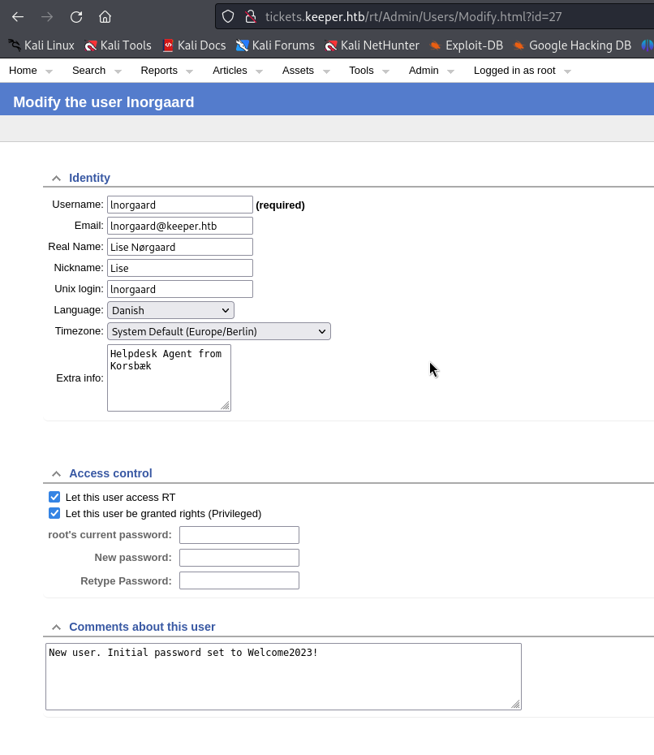

# Keeper — HackTheBox Walkthrough

**Platform:** HackTheBox
**Difficulty:** Easy
**OS:** Linux

---

## TL;DR

Default credentials on a Request Tracker instance (`root:password`) provide access to the dashboard → Enumerating tickets reveals user credentials (`lnorgaard:Welcome2023!`) allowing SSH access → Found a KeePass database and memory dump file → Exploiting KeePass memory dumping vulnerability (CVE-2023-32784) using `keedump` to recover the master password → Extracting the `root` SSH private key from the vault.

---

## Enumeration

Full nmap scan:

```bash
nmap -sC -sV -p- -n -Pn --min-rate=9018 10.10.11.227
```

**Open Ports:**
| Port | Service | Version |
|------|---------|---------|
| 22 | SSH | OpenSSH 8.9p1 Ubuntu |
| 80 | HTTP | nginx 1.18.0 (Ubuntu) |

Port 80 serves a web page that redirects to `http://tickets.keeper.htb/rt`. 
We add `tickets.keeper.htb` and `keeper.htb` to our `/etc/hosts` file.

---

## Exploitation — Default Credentials & Helpdesk Snooping

Navigating to `http://tickets.keeper.htb/rt` presents a login screen for Request Tracker (RT), an open-source ticketing software.

We search online for default credentials for Request Tracker and find that a common default is `root` with the password `password`. 

Trying `root:password` successfully logs us into the Request Tracker dashboard as an administrator.

With administrative access, we browse through the existing helpdesk tickets. We discover a ticket discussing a user issue with KeePass software. The IT team left a memory dump of the software on the user's desktop for analysis.

Further enumeration of the ticket comments reveals the user's initial login credentials handed out by IT:



Credentials Obtained: `lnorgaard:Welcome2023!`

We use these credentials to SSH into the machine:

```bash
ssh lnorgaard@10.10.11.227
```

We now have user access.

---

## Privilege Escalation — KeePass Dump (CVE-2023-32784)

In the user's home directory, we find the KeePass database (`passcodes.kdbx`) and the memory dump (`KeePassDumpFull.dmp`) mentioned in the ticketing system.

KeePass 2.X has a known vulnerability (CVE-2023-32784) where the master password can optionally be extracted from the process memory dump in cleartext (recovering the typed characters sequentially). 

Many public exploits for this are built for Windows, but we search for a cross-platform or Linux-compatible dumper and find a Rust-based implementation: `https://github.com/ynuwenhof/keedump`

We clone and build the exploit on our attacking machine (after transferring the `.dmp` file over):

```bash
git clone https://github.com/ynuwenhof/keedump.git
cd keedump
cargo install --path .
```

We run the dumper against the memory dump:

```bash
keedump -i KeePassDumpFull.dmp
```

The output attempts to reconstruct the password character by character:


It returns a string showing potential missing letters: `dgrd med flde`. 
Searching Google for text matching this pattern reveals a famous Danish dessert phrase: `Rødgrød med fløde`.

We attempt to unlock the `passcodes.kdbx` database using `Rødgrød med fløde` as the master password, and it works flawlessly!

Inside the KeePass vault, we find an entry containing a PuTTY SSH Private Key (`.ppk` file) belonging to the `root` user.

We save the `.ppk` key to our attacking machine. We must convert it to a standard OpenSSH RSA private key using `puttygen` before we can use it:

```bash
puttygen pp_id_rsa.ppk -O private-openssh -o id_rsa
chmod 600 id_rsa
```

Now, we SSH into the machine directly as `root` using the converted key:

```bash
ssh -i id_rsa root@10.10.11.227
```

We are `root`. 🎉

---

## Key Takeaways

- **Default Credentials:** Leaving administrative portals like Request Tracker with default credentials (`root:password`) results in complete compromise. 
- **Helpdesk Sensitive Data:** Support ticket systems are goldmines. Never paste plaintext credentials into ticket comments.
- **KeePass Memory Vulnerability:** CVE-2023-32784 proved that even strong Master Passwords can be bypassed if an attacker secures a memory dump of the running KeePass process prior to version 2.54.

---

*Thanks for reading! Follow for more HackTheBox walkthrough content.*